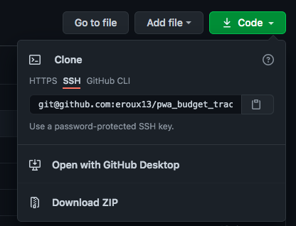
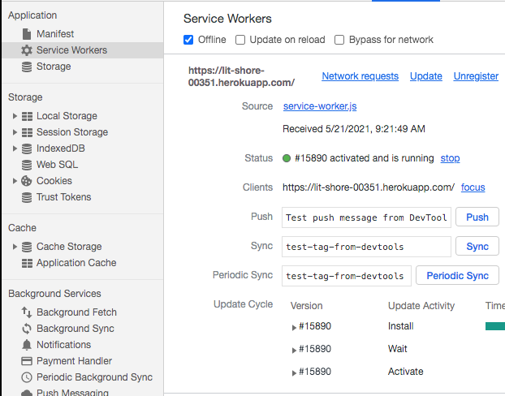
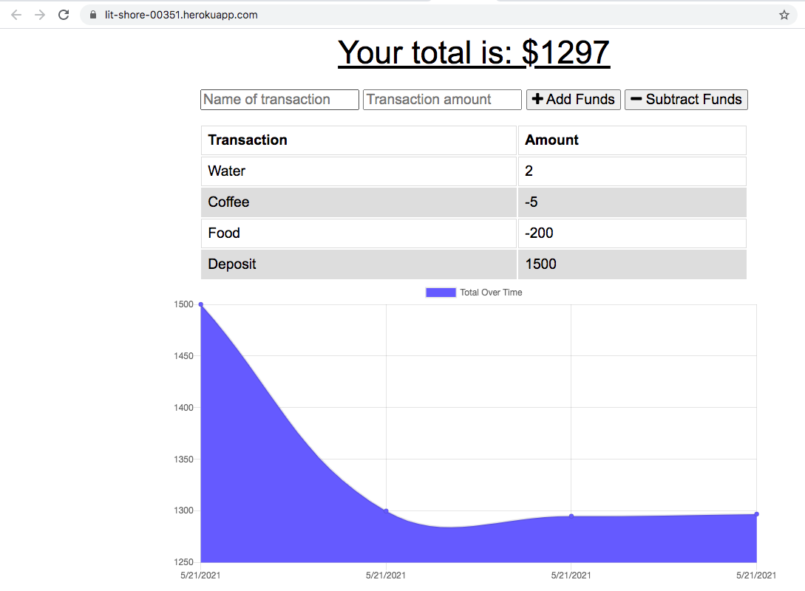

# Budget Tracker

## Description

This application allows a user to be able to add expenses and deposits to their budget with or without a connection. When the application is accessed with no connection, a user is still able to input transactions and once connection has been established, it will dynamically populate via indexedDB. This application features the use of HTML, CSS, JavaScript, MongoDB, and Mongoose.

Deployed Project: https://lit-shore-00351.herokuapp.com/

## Table of Contents

- [Description](#description)
- [License](#license)
- [Installation](#installation)
- [Usage](#usage)
- [Contributors](#contributors)
- [Tests](#tests)
- [Questions](#questions)
- [Screenshots](#screenshots)

## License

License chosen: MIT.
More information about the license chosen can be found on [Open Source Initiative](https://opensource.org/licenses/MIT).

## Installation

To install this project, a user first needs to clone the repo onto their local machine.

Next they need to navigate into the project folder thourgh either terminal or git bash, depending on the users OS, and run `npm i` to install all the dependencies. Next, in a new terminal or git bash window, the user needs to run `mongod`. Then the user can start up the applicaiton by running `npm run start`.

## Usage

The usage of this project is to have an application that is accessible both online and offline to allow a user to track their transactions. In some cases, when a person travels there is a chance that they may not have access to the internet so an application that can help track expenses without needing internet access can prove to be extremely useful.

## Contributors

[eroux13](https://www.github.com/eroux13)

## Tests

There are currently no test scripts for this project, however, the project's offline funstionality can be tested by running the dev tools in the browser and turning the service worker off.

## Questions

Feel free to follow my GitHub [profile](https://www.github.com/eroux13).
If you have any questions about this project, please reach out to me via ej.roux13@gmail.com.

## Screenshots

